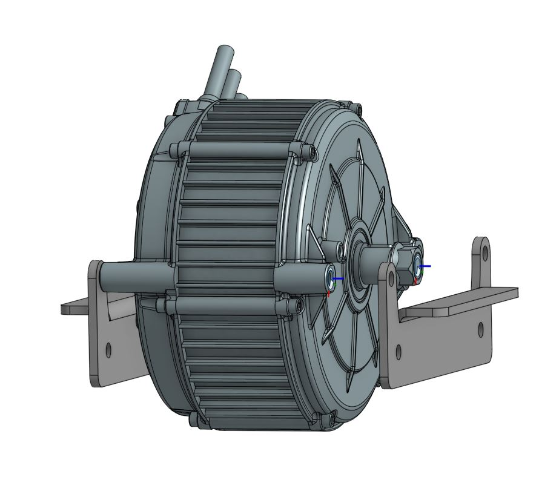
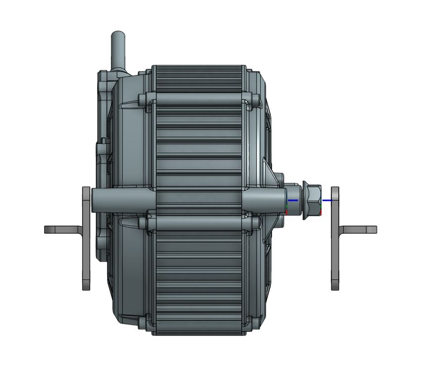
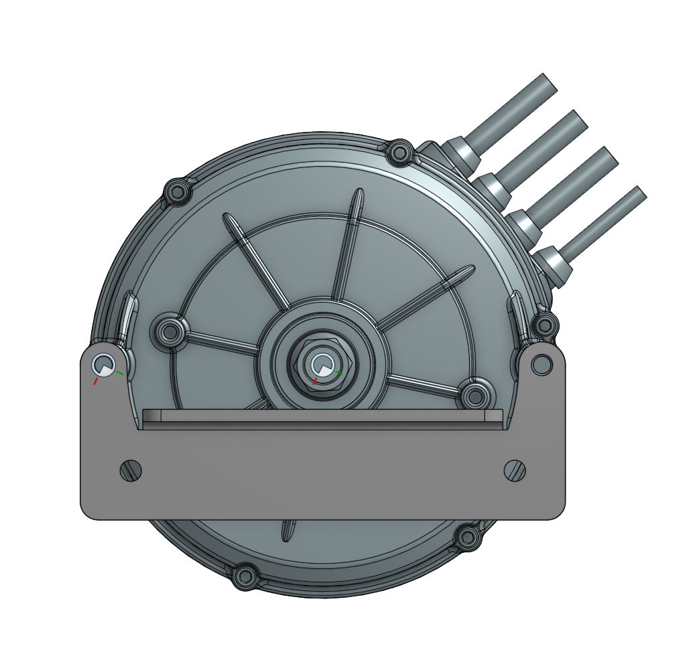

Designs/mods for Razor kid bikes

 
The pictured extension is ~5.5" for 15mm axle but there is a 3.5" 12mm dxf in the cad folder. Step file is in the cad folder. These are designed for the .187" (4.8mm) mild steel is ~$70 for 2 from sendcutsend.
 

 
The QS165 mounts are not confirmed to work but will be updated with confirmation around April 15th. Designed for sendcutsend in 4.8mm mild steel ~$30 shipped in the USA.
